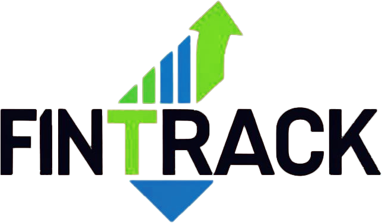

# FinTrack - Personal Budget Management Platform

## Technical Documentation

This document provides a comprehensive overview of the FinTrack application architecture, design patterns, and technical specifications.



## Table of Contents

1. [Project Overview](#project-overview)
2. [System Architecture](#system-architecture)
3. [Technology Stack](#technology-stack)
4. [Database Design](#database-design)
5. [Application Structure](#application-structure)
6. [Key Components](#key-components)
7. [Authentication & Security](#authentication--security)
8. [UI/UX Components](#uiux-components)
9. [API Endpoints](#api-endpoints)
10. [Deployment Instructions](#deployment-instructions)

## Project Overview

FinTrack is a modern web application for personal budget management developed for FinSolutions, a company in the FinTech sector. The platform enables users to track expenses, manage financial goals, and visualize financial data through interactive charts and dashboards.

### Key Features

- User authentication and account management
- Dashboard with financial overview and visualizations
- Budget creation and tracking
- Transaction management with categorization
- Savings goals with progress tracking
- Data export functionality
- Responsive design for mobile and desktop

## System Architecture

FinTrack follows the Model-View-Controller (MVC) architectural pattern:

- **Models**: Define data structures and business logic
- **Views**: EJS templates for rendering UI
- **Controllers**: Handle user requests and manage application flow

The application uses a layered architecture:

1. **Presentation Layer** (Views): UI components and templates
2. **Application Layer** (Controllers): Business logic and request handling
3. **Data Access Layer** (Models): Database operations and data validation
4. **Database Layer**: MySQL database for data persistence

## Technology Stack

### Backend
- **Runtime**: Node.js (v16+)
- **Framework**: Express.js (v4.18.2)
- **Database**: MySQL with Sequelize ORM
- **Authentication**: Express-session with bcrypt
- **Template Engine**: EJS

### Frontend
- **Languages**: HTML5, CSS3, JavaScript (ES6+)
- **CSS Framework**: Custom responsive design
- **Charts**: Chart.js for data visualization
- **AJAX**: Fetch API for asynchronous requests

### Development Tools
- **Version Control**: Git
- **Package Manager**: npm
- **Environment Variables**: dotenv
- **Development Server**: nodemon

## Database Design

FinTrack uses a relational database with the following core models:

### User Model
- Primary entity for authentication and user information
- Stores credentials, profile data, and password reset tokens

### Transaction Model
- Records all financial activities
- Links to users and categories
- Supports income and expense types with dates

### Category Model
- Classifies transactions
- User-specific categories for personalization
- Tracks usage statistics

### Budget Model
- Defines spending limits
- Linked to specific time periods
- Tracks planned vs actual spending

### Saving Model
- Manages financial goals
- Tracks progress towards targets
- Supports timeline-based goals

### Entity Relationships
- Users have many Transactions, Categories, Budgets, and Savings
- Transactions belong to Categories
- All entities are user-scoped for data isolation

## Application Structure

```
project-root/
├── config/              # Configuration files
│   └── database.js      # Database connection setup
├── controllers/         # Request handlers
│   ├── UserController.js
│   ├── TransactionController.js
│   ├── BudgetController.js
│   ├── CategoryController.js
│   └── SavingController.js
├── middleware/          # Custom middleware
│   └── authMiddleware.js
├── models/              # Sequelize models
│   ├── User.js
│   ├── Transaction.js
│   ├── Category.js
│   ├── Budget.js
│   ├── Saving.js
│   └── index.js
├── public/              # Static assets
│   ├── css/             # Stylesheets
│   ├── js/              # Client-side scripts
│   └── assets/          # Images and other assets
├── routes/              # Route definitions
│   └── Routes.js
├── views/               # EJS templates
├── index.js             # Application entry point
└── package.json         # Project dependencies
```

## Key Components

### Authentication System

The authentication system provides:

- User registration with email validation
- Secure login with password hashing
- Password reset via email
- Session-based authentication
- Account management

Implementation details:
- Uses bcrypt for secure password hashing
- Express-session for session management
- Middleware protection for authenticated routes
- CSRF protection

### Dashboard Module

The dashboard provides an overview of the user's financial status:

- Expense breakdown by category (pie chart)
- Monthly income vs expenses (bar chart)
- Recent transactions list
- Budget progress indicators
- Savings goals summary

The dashboard uses AJAX to fetch data from various API endpoints and renders dynamic charts using Chart.js.

### Transaction Management

Features:
- CRUD operations for financial transactions
- Categorization and filtering
- Search functionality
- Date range selection
- Data export (CSV)

Implementation details:
- Server-side pagination
- Input validation
- Category association
- Dynamic updates without page refresh

### Budget System

Features:
- Monthly budget planning
- Progress tracking
- Visual indicators for budget health
- Historical budget data

Implementation details:
- Real-time calculations of remaining budget
- Visual progress bars
- Monthly reset capability
- Budget vs actual comparison

### Savings Goals

Features:
- Goal creation with target amounts and dates
- Progress tracking with visual indicators
- Contribution recording
- Goal completion celebration

Implementation details:
- Timeline calculations
- Progress percentage
- Status updates (on track, behind, completed)

## Authentication & Security

### User Authentication

- **Registration**: Email verification with unique usernames
- **Login**: Password hashing with bcrypt
- **Sessions**: Express-session for maintaining user state
- **Password Reset**: Secure token-based reset via email

### Security Measures

- **Password Protection**: Bcrypt for password hashing
- **Input Validation**: Express-validator for form inputs
- **Session Security**: HTTP-only cookies, secure flags in production
- **XSS Protection**: Content Security Policy
- **CSRF Protection**: Token validation for form submissions
- **SQL Injection Prevention**: Parameterized queries via Sequelize

## UI/UX Components

### Responsive Design

The application uses a responsive design approach:
- Mobile-first CSS
- Flexbox and Grid layouts
- Responsive typography
- Touch-friendly interactive elements

### Custom Dialog System

A unified notification and confirmation system:
- Replaces browser default alerts/confirms
- Consistent styling across the application
- Toast notifications for user feedback
- Modal dialogs for confirmations

### Data Visualization

Interactive charts using Chart.js:
- Pie/Doughnut charts for expense categories
- Bar charts for income vs expenses
- Line charts for spending trends
- Progress bars for budget and savings tracking

## API Endpoints

### User Endpoints

- `POST /auth/register` - Create new user account
- `POST /auth/login` - Authenticate user
- `GET /auth/logout` - End user session
- `POST /auth/reset-request` - Request password reset
- `POST /auth/reset-password` - Set new password

### Transaction Endpoints

- `GET /api/transactions` - List user transactions
- `POST /api/transactions` - Create new transaction
- `PUT /api/transactions/:id` - Update transaction
- `DELETE /api/transactions/:id` - Delete transaction
- `GET /api/transactions-summary` - Get financial overview
- `GET /api/transactions-monthly` - Get monthly income/expense data
- `GET /api/spending-trend` - Get spending trends

### Budget Endpoints

- `GET /api/budgets` - List user budgets
- `POST /api/budgets` - Create new budget
- `PUT /api/budgets/:id` - Update budget
- `DELETE /api/budgets/:id` - Delete budget
- `GET /api/budget-overview` - Get budget progress

### Category Endpoints

- `GET /api/categories` - List user categories
- `POST /api/categories` - Create new category
- `PUT /api/categories/:id` - Update category
- `DELETE /api/categories/:id` - Delete category

### Saving Endpoints

- `GET /api/savings` - List saving goals
- `POST /api/savings` - Create saving goal
- `PUT /api/savings/:id` - Update saving goal
- `DELETE /api/savings/:id` - Delete saving goal
- `POST /api/savings/:id/contribute` - Add to saving goal

## Deployment Instructions

### Development Environment

1. **Prerequisites**:
   - Node.js (v16+)
   - MySQL server
   - Git

2. **Installation**:
   ```bash
   # Clone the repository
   git clone [repository-url]
   
   # Install dependencies
   npm install
   
   # Create .env file (see .env.example)
   cp .env.example .env
   
   # Set up database
   mysql -u [username] -p [database] < db_schema.sql
   
   # Start development server
   npm run dev
   ```

### Production Deployment

1. **Environment Configuration**:
   - Set NODE_ENV=production
   - Configure secure database credentials
   - Enable HTTPS

2. **Build Process**:
   ```bash
   # Install dependencies
   npm ci
   
   # Start production server
   npm start
   ```

3. **Hosting Options**:
   - Node.js hosting services (Heroku, Railway, etc.)
   - VPS with Nginx/Apache as reverse proxy
   - Docker containerization

4. **Security Considerations**:
   - Enable HTTPS
   - Set secure cookie options
   - Configure rate limiting
   - Implement proper logging
- Transaction management with categorization
- Savings goals with progress tracking
- Data export functionality
- Responsive design for mobile and desktop
